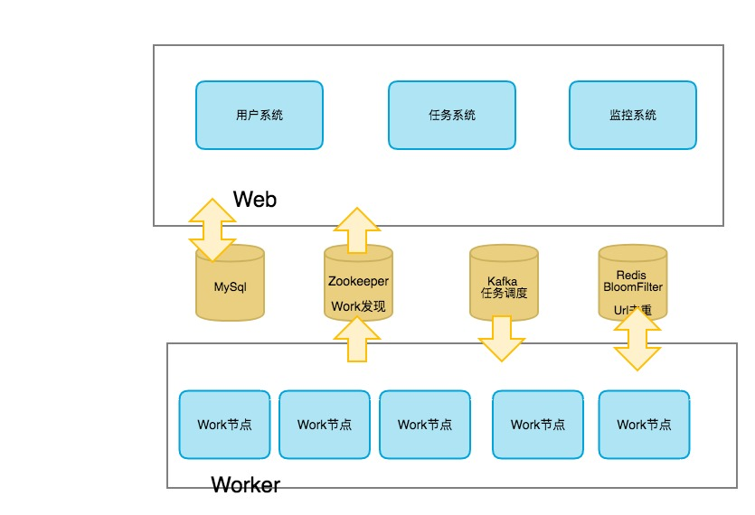

## CCrawler

一个分布式自动化爬虫

#### 1. 目标

- 通过web界面添加规则，后台自动化爬取目标网页
- 可定义存储类型-> (redis or mysql or hbase or hdfs or mq)
- 可监控爬取状态，提供日志监控，可配置报警规则
- 具有灵活的高可用性

#### 2. 设计图

#### 3. 接口 & 页面

##### 3.1 页面

| 模块   | 接口名称                  | 描述   |
| ---- | --------------------- | ---- |
| 用户   | 用户登录                  |      |
|      | 用户注册                  |      |
|      | 用户审核(管理员可见)           |      |
| 任务   | 查看具体任务状态(爬取数据量/失败数据量) |      |
|      | 新增任务                  |      |
|      | 查看任务列表                |      |
| 监控   | 节点状态列表                |      |
|      | 查看错误信息                |      |
|      | 查看节点机器状态              |      |
| 其他   | 错误页面                  |      |

#### 4. 疑问

- 新增的任务存放在哪？
  - 存MySql然后更新Zookeeper状态 ?
- 页面是尽量用模版还是尽量用异步接口?
  - 前期先使用模版快速开发?
- 使用Kafka是否合理，或者选择使用RabbitMQ?
- 前期开发方案
  - 先做页面这边的，方便调试

#### 5. TODO

- ~~完善详细设计，搭建基本框架和服务~~
- 前端页面开发

#### 6. 更新日志

- 2017.09.12 初始化项目并定制基本架构